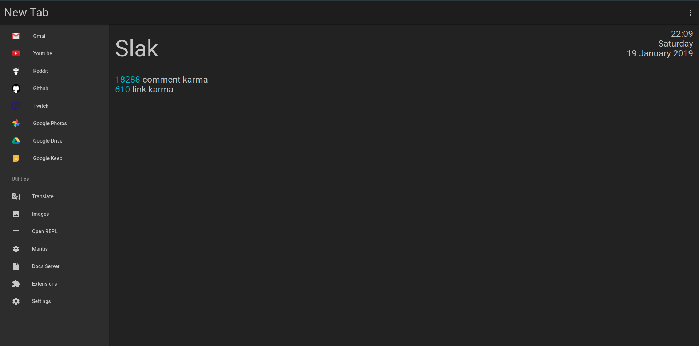
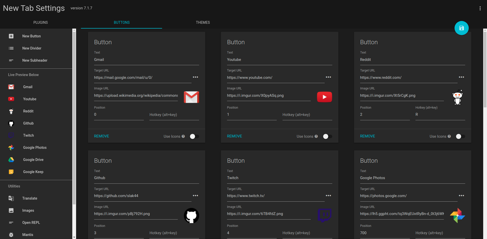
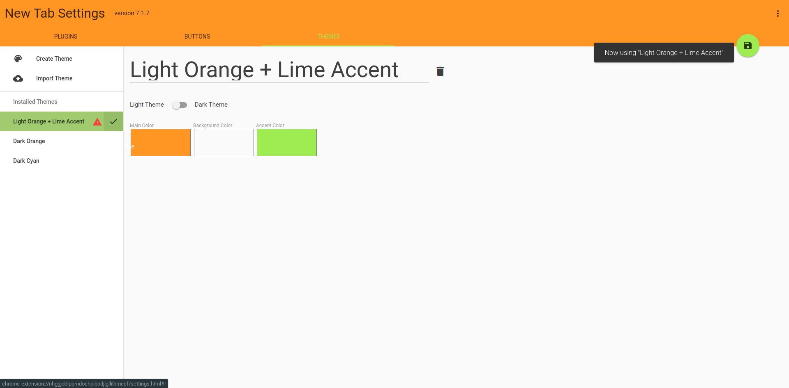

# ChromeNewTab

A chrome extension that replaces the new tab.

Example configuration:




## Installation

Download `ext.crx` and `plugins.zip` from [here](https://github.com/slak44/ChromeNewTab/releases/latest).
Go to `chrome://extensions` in your browser, then drag `ext.crx` inside.
Navigate to the settings page to add buttons, plugins, and themes.

**IMPORTANT**: Chrome 35 and above disallow installation of non-webstore extensions. See [this](https://superuser.com/a/768154/442735) for possible workarounds.

## Building the extension

Run `npm install` then `gulp pack`, and the extension can be found packed in the `./build/dist` directory, or unpacked in the `./build/src` directory.

## Creating plugins

#### With the plugin bundler
- Run `npm init` in the plugin's folder and fill out the info
- Use `npm install --save` to add your dependencies
- Create a `package.json` like the one described below
- Run the bundler (`node bundler.js`), with the first argument the plugin folder, and the second a path to write the compiled plugin file to

#### List of views for inserting HTML/CSS
- `main`: the main page, the 'new tab'
- `settings`: the extension's options page
- `global`: matches any view

#### List of hooks for executing JS
Any of these can access a plugin api object called `api`.
- `main`: runs on the main view
- `settings`: runs on the settings view
- `global`: runs on any view, but before the view-specific hook
- `init`: is executed only on plugin install/update

#### Plugin `api` object
- `api.setting(settingName)`: get value of specified setting, or its default if it's unset
- `api.insertStyle(css)`: insert the given css string into an inline style element
- `api.registerAction(displayName, actionPathname, handler)`: register a handler for a custom button action. Run this in the `global` hook
- `api.insertView(htmlElement, order, alignment)`: (only in the `main` hook) insert a view to the default activity. `alignment` can be `left`, `center` or `right`. `order` is the order within each alignment, and it maps to the css property `order`
- `api.pushActivity(activityName, htmlElement)`: (only in the `main` hook) navigate to another activity. When called, the current activity's element will be hidden, the given element will be shown, the `activityName` will replace the tab title and navbar title, and a button to navigate back appears in the navbar
- `api.popActivity()`: (only in the `main` hook) hide current activity, and show previous one. If the default activity is shown, this function is a no-op

#### Plugin `package.json` format
This file is used by `npm` and by the bundler. Paths are relative to the `package.json`'s directory.
```
  {
    "pluginName": "displayName",
    "description": "message",
    "author": "name",
    "version": "1.1.1",
    "settings": [],
    "dependencies": {},
    "webpackConfig": "path/to/webpack.config",
    "html": {
      "main": {
        "path/to/file1.html": "querySelector1",
        "path/to/file2.html": "querySelector2"
        ...
      },
      "settings": {
        "path/to/file1.html": "querySelector1",
        "path/to/file2.html": "querySelector2"
        ...
      },
      "global": {
        "path/to/file1.html": "querySelector1",
        "path/to/file2.html": "querySelector2"
        ...
      }
    },
    "css": {
      "main": ["path/to/file1.css", "path/to/file2.css", ...],
      "settings": ["path/to/file3.css", "path/to/file4.css", ...],
      "global": ["path/to/file5.css", "path/to/file6.css", ...]
    },
    "js": {
      "main": "path/to/file1.js",
      "settings": "path/to/file2.js",
      "global": "path/to/file3.js",
      "init": "path/to/file4.js"
    }
  }
```
- `pluginName`: (string) name of plugin
- `description`: (string) plugin description
- `author`: (string) self-explanatory
- `version`: (string) [semver](http://semver.org/) version string
- `settings`: (array of objects) setting format described below. Setting values are preserved during updates only if the `name` and `type` properties are unchanged
- `dependencies`: (object) npm's dependencies field
- `webpackConfig`: (path string) path to a webpack config to be require'd. The `entry` and `output` properties are handled by the bundler
- `html`: (object) each property represents a view. For each view, there are html files associated with a query selector. The html will be inserted in the element obtained from the selector
- `css`: (object) each property represents a view. The css files for each view are concatenated, and the merged data is appended to an inline stylesheet after the html has been inserted
- `js`: (object) each property represents a hook. The js at the specified path for each hook is an entry point for webpack

## Implementation details

#### Theme format
Themes are just JSON files:
```
{
  "name": "Default Theme",
  "isDark": false,

  "background": "#FAFAFA",
  "main": "#FF9800",
  "accent": "#B2FF59",

  "deleted": undefined
}
```
- `name`: (string) name of theme
- `isDark`: (boolean) whether or not the theme should be considered "dark", as dark themes trigger light styles for some elements/text
- `background`, `main`, `accent`: (css color strings) base colors for the UI
- `deleted`: (optional boolean) if true, it signals that this theme was "deleted" by the user; this element will be *removed before saving* to storage

#### Plugin format
Usually, this is to be generated by the bundler from the `package.json` above. This should be valid JSON.
```
  {
    "name": "displayName",
    "desc": "message",
    "author": "name",
    "version": "1.1.1",
    "settings": [],
    "js": {
      "init": "(function (api) {})()",
      "global": "(function (api) {})()",
      "main": "(function (api) {})()",
      "settings": "(function (api) {})()"
    },
    "css": {
      "main": "cssText",
      "settings": "cssText",
    },
    "html": {
      "main": {
        "querySelector": "htmlToAdd"
        ...
      },
      "settings": {
        "querySelector": "htmlToAdd"
        ...
      }
    },
    "deleted": undefined
  }
```
- `name`: (string) see above, is equivalent to `pluginName`
- `desc`: (string) see above, is equivalent to `description`
- `author`: (string) see above
- `version`: (semver string) see above
- `settings`: (array of setting objects) see above
- `js`: (object) all functions are stringified IIFEs, each property is a hook
- `css`: (object) the css from each property will be added to it's respective view
- `html`: (object of objects) every property targets a view. For every view, `htmlToAdd` will be added at the position specified by the `querySelector`. There can be multiple `querySelector`s
- `deleted`: (optional boolean) if true, it signals that this plugin was "deleted" by the user; this element will be *removed before saving* to storage

#### Setting format
```
  {
    "name": "displayName",
    "desc": "message",
    "type": "type",
    "valid": [],
    "default": "",
    "value": undefined,
    "isVisible": true
  }
```
- `name`: (string) title of setting
- `desc`: (optional string) description of setting
- `type`: (enum string) [input types](https://developer.mozilla.org/en-US/docs/Web/HTML/Element/input), or `enum`
- `valid`: (array of objects) if `type` is `enum`, this is a list of objects with a `name` and a `value` property, otherwise not defined
- `default`: (any) if the value is not set, this value should be used as a default
- `value`: (any) undefined until set
- `isVisible`: (boolean) if false, it means this 'setting' is just storage

#### Button format
```
  {
    "kind": "default",
    "pictureType": "image",
    "imagePath": "http://example.com",
    "ligatureName": "",
    "href": "http://example.com",
    "text": "Button",
    "position": 3.14,
    "hotkey": "K",
    "deleted": undefined
  }
```
- `kind`: (enum string) what kind of "button" it is; values are `default`, `divider`, `subheader`
- `pictureType`: (enum string) if it is `image`, use the `imagePath`, if it is `icon` use `ligatureName`
- `imagePath`: (uri string) path to image
- `ligatureName`: (string) name of material icon
- `href`: (uri string) where does it point to
- `text`: (string) displyed text
- `position`: (float) used to determine order of buttons
- `hotkey`: (string) using alt+key triggers the button
- `deleted`: (optional boolean) if true, it signals that this button was "deleted" by the user; this element will be *removed before saving* to storage

## reddit API
This API is used in [/plugins/reddit/main.js](https://github.com/slak44/ChromeNewTab/tree/master/plugins/reddit/main.js).  
The page will perform GET requests for the user data associated with the given username.
